# laba-2
#  Velvet Bite

**Velvet Bite** 
Проєкт реалізує сайт кафе з меню десертів і кавових напоїв, де користувач може переглянути страви, отримати їхній опис, склад, калорійність та ціну. Сайт має окремі сторінки для кожної позиції, а також секцію “Про нас” і форму зворотного зв’язку.

---

## Мета роботи
Створення професійного робочого середовища для командної розробки програмного забезпечення,  
оволодіння основними принципами роботи з системою контролю версій **Git**  
та впровадження ефективного **Git workflow** для групової роботи над програмними проєктами.

---

## Опис проєкту

**Velvet Bite** — це динамічний сайт кафе, побудований на базі **Flask (Python)**,  
який відображає меню страв із серверних даних.  

Відвідувач може:
- ознайомитися з асортиментом десертів та кави;
- натиснути на страву, щоб переглянути детальний опис;
- переглянути інгредієнти, калорійність та вартість;
- скористатися формою для зв’язку з кафе.

---

## Основна функціональність

- **Головна сторінка** — коротке вітання та кнопка переходу до меню  
- **Меню** — перелік десертів і напоїв (зображення, опис, ціна)  
- **Сторінка окремої страви** — детальна інформація (опис, інгредієнти, калорійність, ціна)  
- **Контактна форма** — поля для введення імені, пошти та повідомлення  
- **Сторінка “Про нас”** — інформація про кафе  
- **Навігаційне меню** (“Головна”, “Меню”, “Контакти”, “Про нас”)  

---

## Використані технології

| Категорія | Технології |
|------------|-------------|
| **Мови розмітки та стилів** | HTML (43%), CSS (38.5%) |
| **Мова програмування** | Python (17.8%) |
| **Скрипти / інтерактивність** | JavaScript (0.7%) |
| **Фреймворк** | Flask |
| **Інструменти** | VS Code, Git, GitHub |
| **Контроль версій** | Git Workflow (branch → commit → pull request → merge) |

---
# Інсталяція та запуск: 
прописати команду cd document в Gitbush, далі відкрити GitHub, копіювати посилення репозиторію(https://github.com/s1060755-star/laba-2.git), в Gitbush прописати команду git clone посилання
## Структура репозиторію
laba-2/ 
│
├── static/
│   ├── images/
│   │   ├── americano.jpg
│   │   ├── banner3.jpg
│   │   ├── cheesecake.jpg
│   │   ├── cheesecakechery.jpg
│   │   ├── kapych.jpg
│   │   ├── latte.jpg
│   │   └── mini.jpg
│   │
│   ├── script.js
│   └── style.css
│
├── templates/
│   ├── about.html
│   ├── dish.html
│   └── index.html
│
├── .gitignore
├── main.py
└── README.md    
# Git Workflow команди
Для організації командної роботи над проєктом Velvet Bite використовувався Git та GitHub.
Команда дотримувалася базового Git Workflow для спільної розробки, який включав такі етапи:
1)Створення репозиторію
⦁	Репозиторій проєкту було створено на GitHub.
⦁	Учасники команди отримали доступ через collaborators
2)Клонування репозиторію - https://github.com/s1060755-star/laba-2.git
Кожен учасник працював із власною локальною копією проєкту у VS Code.
3)Робота в окремих гілках
⦁	Для кожної частини сайту створювалася окрема гілка:
git checkout -b feature/navbar
git checkout -b feature/menu
git checkout -b feature/contacts
Це дозволяло уникати конфліктів у коді.

4)Коміти 
git commit -m "Initial commit"
git commit -m "Inital commit:added base project files"
git commit -m "Update main.py"
git commit -m "feat: add test function hello in main.py"
git commit -m "Update main.py"
git commit -m "Merge branch 'main' into feature/navbar"
git commit -m "Merge pull request #1 from s1060755-star/feature/navbar"
git commit -m "chore: add base files for cafe website"
git commit -m "Update main.py"
git commit -m "Merge pull request #2 from s1060755-star/feature/menu"
git commit -m "Update main.py"
git commit -m "Merge branch 'main' into feature/contacts"
git commit -m "Merge pull request #3 from s1060755-star/feature/contacts"
git commit -m "Initial commit: index.html; style.css; script.js; main.py; images."
git commit -m "feat: add files"
git commit -m "feat: fiksyla faily"
git commit -m "feat: flask"
git commit -m "feat: fix site"
git commit -m "feat: update README.md, added CHANGLELOG.md, added laba-2-report.md"
git commit -m "feat: update laba-2-report.md"

5)Публікація змін на GitHub
git push origin feature/menu
git push origin main

6)Pull Request (PR)
Після завершення роботи над функціоналом учасник створював Pull Request для перевірки змін.
Інші члени команди могли переглянути код, залишити коментарі або запропонувати виправлення.

7)Злиття гілок і оновлення main
Після перевірки PR зміни об’єднувалися з головною гілкою main:
git checkout main
git pull origin main

8)Робота з конфліктами
Якщо виникали конфлікти, вони вирішувались безпосередньо у VS Code.
# Учасники команди 
⦁	Скоп`юк Олександра Іванівна, Team Leader (посилання на профіль GitHub - https://github.com/s1060755-star)
⦁	Зінькевич Олександра Василівна, Developer (посилання на профіль GitHub - https://github.com/szinkevych09-pixel)
⦁	Матяш Дарія Сергіївна, QA/Документатор (посилання на профіль GitHub - https://github.com/TuffDasha)


# Лабораторна робота №5: Розробка RESTful API

## Інформація про проєкт
- **Назва проєкту:** [Velvet Bite]
- **Автори:** [Скоп`юк Олександра Іванівна, Зінькевич Олександра Василівна, Матяш Дарія Сергіївна]


## Опис проєкту
[API надають можливість взаємодії з інформацією про страви, замовлення, акаунти та обрані страви. Вони дозволяють отримувати списки та окремі елементи, створювати нові записи, оновлювати та видаляти існуючі, обробляють запити та відповіді у форматі JSON і повертають відповідні коди стану для коректної обробки помилок.]

## Технології
- Python 3.11
- Flask
- SQLite
- JavaScript
- Postman
- Flasgger
- Swagger

## Endpoints API

### 1. [Get All Dishes]
- **URL:** `/api/v2/dishes`
- **Метод:** `GET`
- **Опис:** [Показує всі страви]
- **Приклад запиту:**
```json
  GET "http://127.0.0.1:5000/api/v2/dishes"
```
- **Приклад відповіді:**
```json
  {
    "calories": 350,
    "description": "Спробуйте наш фірмовий десерт!",
    "id": 1,
    "image": "images/mini.jpg",
    "ingredients": "бісквіт, крем, цукор",
    "name": "Міні Червоний Оксамит",
    "price": "115.0"
  },
  {
    "calories": 200,
    "description": "Класичний лате з нотками вишні та легкою пінкою",
    "id": 2,
    "image": "images/latte.jpg",
    "ingredients": "кава, молоко, вишня ",
    "name": "Лате Velvet",
    "price": "65.0"
  },
  {
    "calories": 400,
    "description": "Домашній сирник з вершковим сиром",
    "id": 3,
    "image": "images/cheesecake.jpg",
    "ingredients": "біскрвіт, сирний крем, цукор ",
    "name": "Сирник класичний",
    "price": "70.0"
  }
```
- **Скріншот з Postman (або Swagger):**
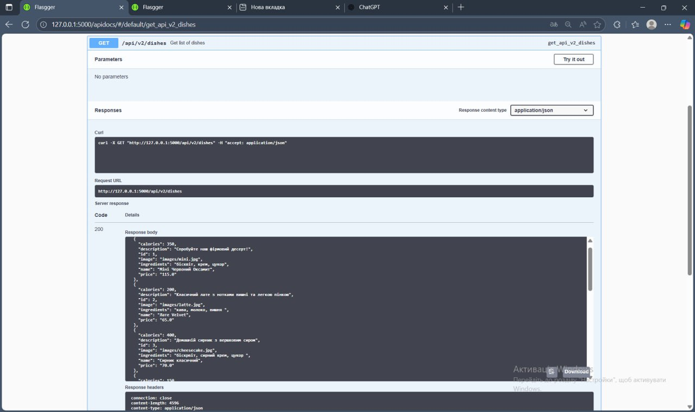

### 2. [Get Dish by ID]
- **URL:** `/api/v2/dishes/1`
- **Метод:** `GET`
- **Опис:** [Надає інформацію про окрему страву за ID]
- **Приклад запиту:**
```json
  GET "http://127.0.0.1:5000/api/v2/dishes/3"
```
- **Приклад відповіді:**
```json
{
  {
  "calories": 400,
  "description": "Домашній сирник з вершковим сиром",
  "id": 3,
  "image": "images/cheesecake.jpg",
  "ingredients": "біскрвіт, сирний крем, цукор ",
  "name": "Сирник класичний",
  "price": "70.0"
}
}
```
- **Скріншот з Postman (або Swagger):**
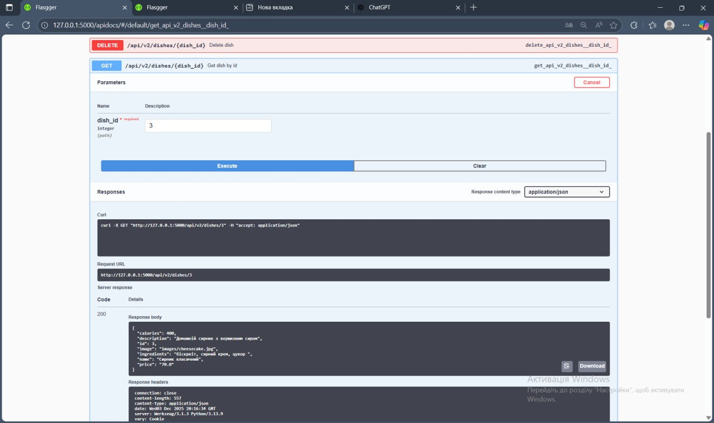

### 3. [Create Dish]
- **URL:** `/api/v2/dishes`
- **Метод:** `POST`
- **Опис:** [Створює страву]
- **Приклад запиту:**
```json
{
  "name": "Test Soup",
  "price": 50.0,
  "image": "",
  "description": "Тестова страва",
  "ingredients": "вода, сіль",
  "calories": 120
}
```
- **Приклад відповіді:**
```json
{
  "id": 532
}
```
- **Скріншот з Postman (або Swagger):**
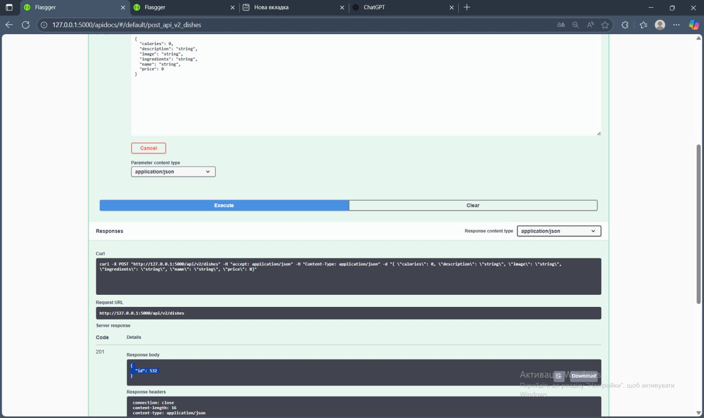

### 4. [Update Dish]
- **URL:** `/api/dishes/1`
- **Метод:** `PUT`
- **Опис:** [Оновлює страву]
- **Приклад запиту:**
```json
"name": "cake",
  "price": 60.0
```
- **Приклад відповіді:**
```json
{
    "calories": 80,
    "description": "Справжня класика кавового смаку",
    "id": 5,
    "image": "images/americano.jpg",
    "ingredients": "кава",
    "name": "Амерекано",
    "price": "55.0"
}
```
- **Скріншот з Postman (або Swagger):**
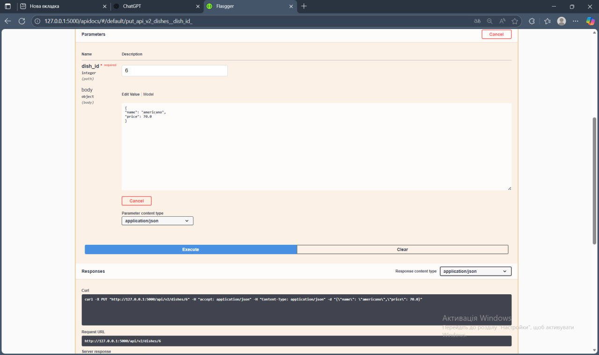

### 5. [Delete Dish]
- **URL:** `/api/dishes/1`
- **Метод:** `DELETE`
- **Опис:** [Видаляє страву]
- **Приклад запиту:**
```json
  DELETE "http://127.0.0.1:5000/api/v2/dishes/9"
```
- **Приклад відповіді:**
```json
{
  "ok": true
}
```
- **Скріншот з Postman (або Swagger):**
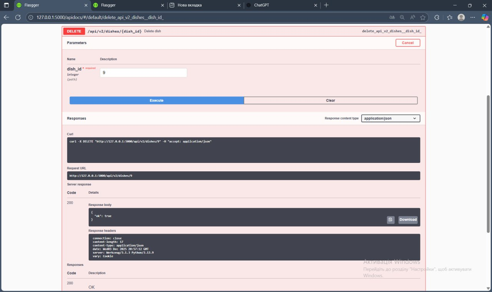

### 6. [Get Orders]
- **URL:** `/api/orders`
- **Метод:** `GET`
- **Опис:** [Надає інформацію про замовлення]
- **Приклад запиту:**
```json
  GET "http://127.0.0.1:5000/api/v2/orders"
```
- **Приклад відповіді:**
```json
 {
    "address": null,
    "created_at": "2025-11-13T13:10:16.662869",
    "customer_name": "Гість",
    "id": 1,
    "items": "[{\"dish_id\": 2, \"qty\": 1}]",
    "phone": null,
    "status": "completed",
    "total": 0
  },
  {
    "address": "Kyma 23",
    "created_at": "2025-11-13T16:17:24.413021",
    "customer_name": "Зінькевич Олександра",
    "id": 2,
    "items": "[{\"dish_id\": 2, \"qty\": 1}]",
    "phone": "0974612700",
    "status": "pending",
    "total": 0
  }
```
- **Скріншот з Postman (або Swagger):**
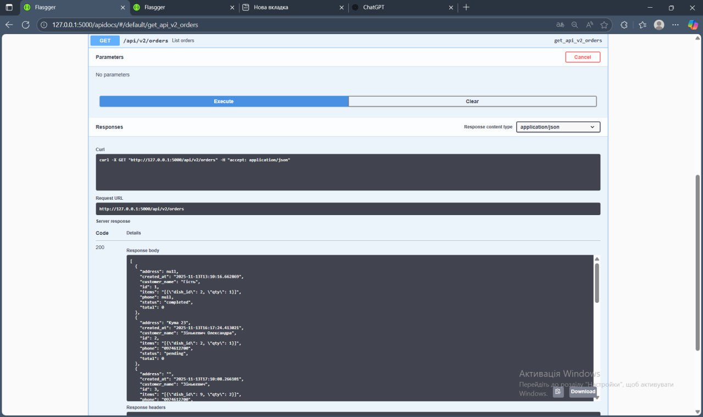

### 7. [Create Order]
- **URL:** `/api/orders`
- **Метод:** `POST`
- **Опис:** [Створює замовлення]
- **Приклад запиту:**
```json
{
  "name": "Test User",
  "phone": "380123456789",
  "address": "Test address",
  "items": [{"dish_id":1, "qty":1}]
}
```
- **Приклад відповіді:**
```json
{
  "id": 530,
  "total": 0
}
```
- **Скріншот з Postman (або Swagger):**
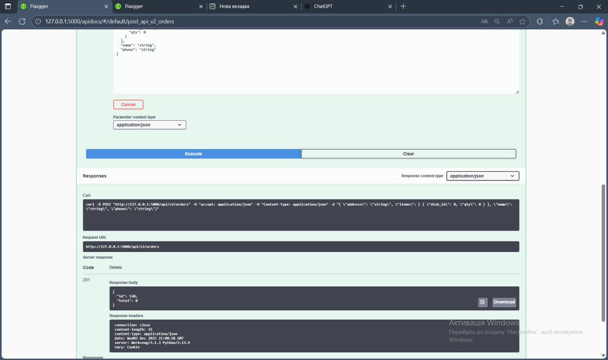

### 8. [Get Accounts]
- **URL:** `/api/accounts`
- **Метод:** `GET`
- **Опис:** [Показує всі аккаунти]
- **Приклад запиту:**
```json
  GET "http://127.0.0.1:5000/api/v2/accounts"
```
- **Приклад відповіді:**
```json
  {
    "avatar": "https://i.pinimg.com/736x/9b/b3/93/9bb39320b6e173fca583c4e8602473c3.jpg",
    "bio": "<3",
    "email": "s.zinkevych09@gmail.com",
    "first_name": "Зінькевич",
    "id": 1,
    "last_name": "Олександра",
    "phone": "0974612700"
  }
```
- **Скріншот з Postman (або Swagger):**
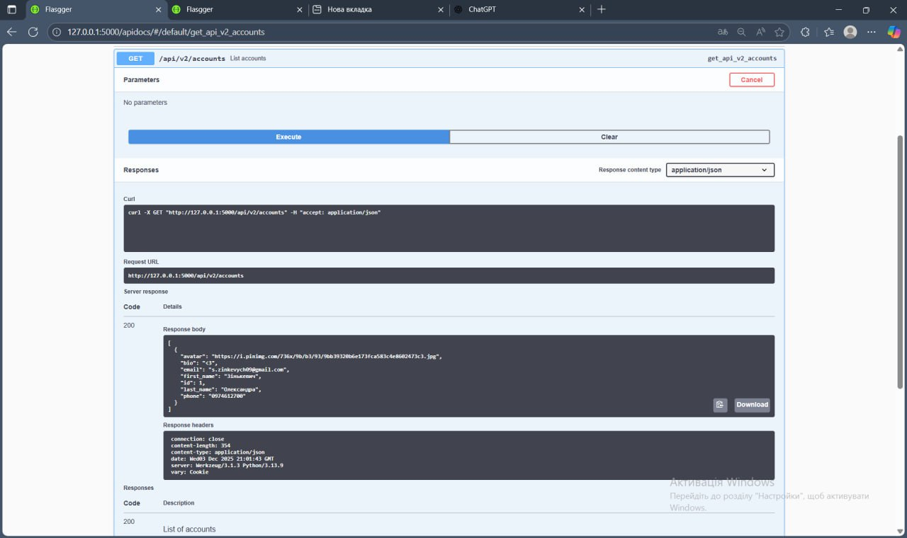

### 9. [Get Favourites for Account (example id=1)]
- **URL:** `/api/favourites/1`
- **Метод:** `GET`
- **Опис:** [Видає улюблені страви по ID аккаунта]
- **Приклад запиту:**
```json
  GET "http://127.0.0.1:5000/api/v2/favourites/1"
```
- **Приклад відповіді:**
```json
{
    "dish_id": 8,
    "id": 13,
    "image": "images/krembrule.jpg",
    "name": "Крем брюле",
    "price": "95.0"
  },
  {
    "dish_id": 1,
    "id": 14,
    "image": "images/mini.jpg",
    "name": "Міні Червоний Оксамит",
    "price": "115.0"
  }
```
- **Скріншот з Postman (або Swagger):**
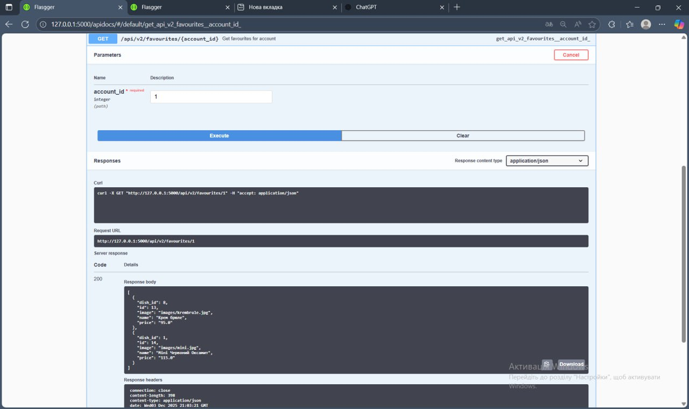

## Результати тестування в Postman (або Swagger)

### Тестовий сценарій 1: [Get All Dishes]
- **Мета:** [Перевірити, що API повертає список всіх страв у форматі JSON зі статусом 200.]
- **Результат:** ✅ Успішно
- **Скріншот:**
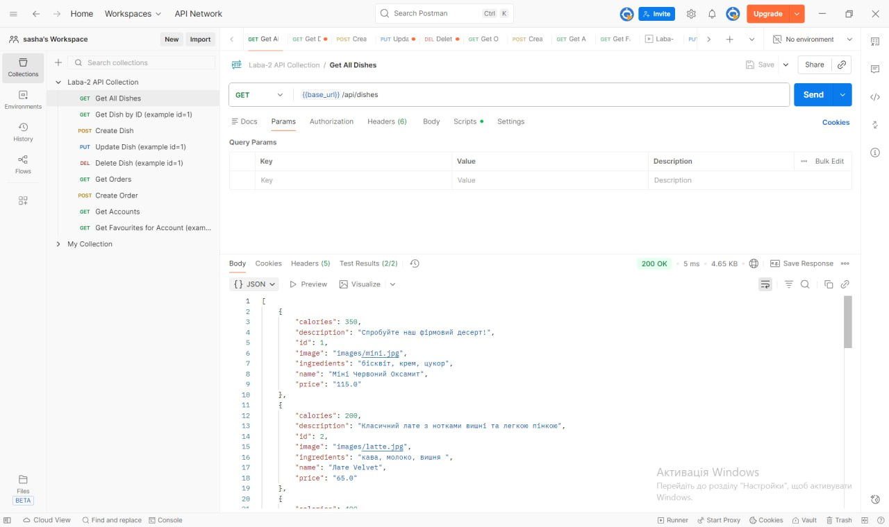

### Тестовий сценарій 2: [Get Dish by ID]
- **Мета:** [Перевірити, що API повертає конкретну страву за ID]
- **Результат:** ✅ Успішно 
- **Скріншот:**
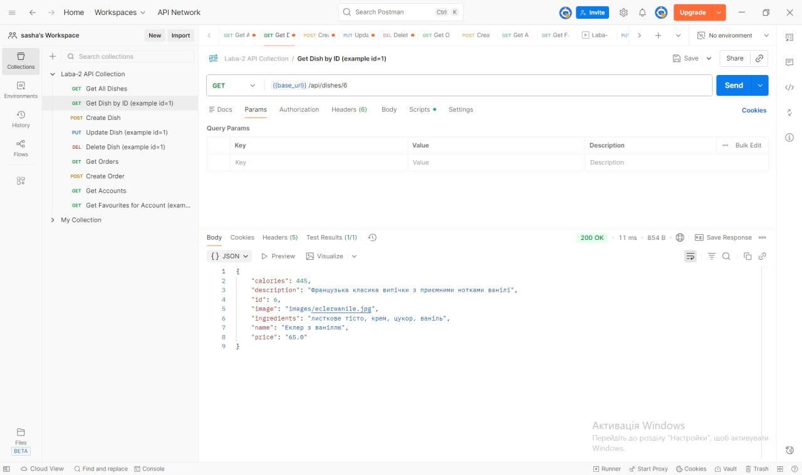

### Тестовий сценарій 3: [Create Dish]
- **Мета:** [Перевірити, що API дозволяє створити нову страву з коректними даними.]
- **Результат:** ✅ Успішно 
- **Скріншот:**


### Тестовий сценарій 4: [Update Dish]
- **Мета:** [Перевірити, що API дозволяє оновити існуючу страву]
- **Результат:** ✅ Успішно 
- **Скріншот:**
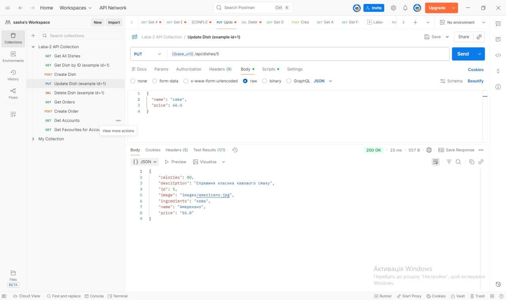

### Тестовий сценарій 5: [Delete Dish]
- **Мета:** [Перевірити, що API дозволяє видалити страву]
- **Результат:** ✅ Успішно 
- **Скріншот:**
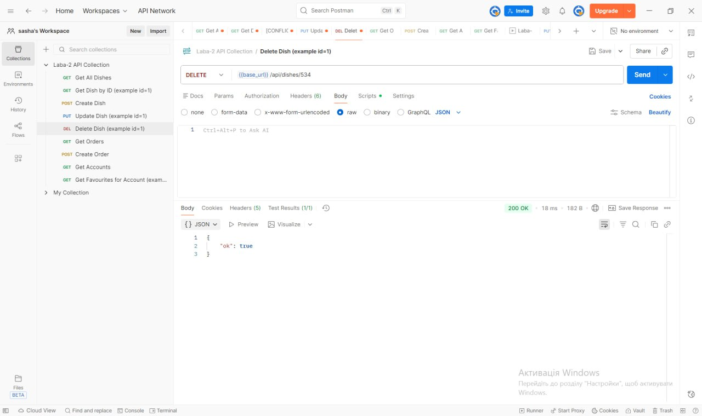

### Тестовий сценарій 6: [Get Orders]
- **Мета:** [Перевірити, що API повертає список всіх замовлень у форматі JSON зі статусом 200.]
- **Результат:** ✅ Успішно 
- **Скріншот:**
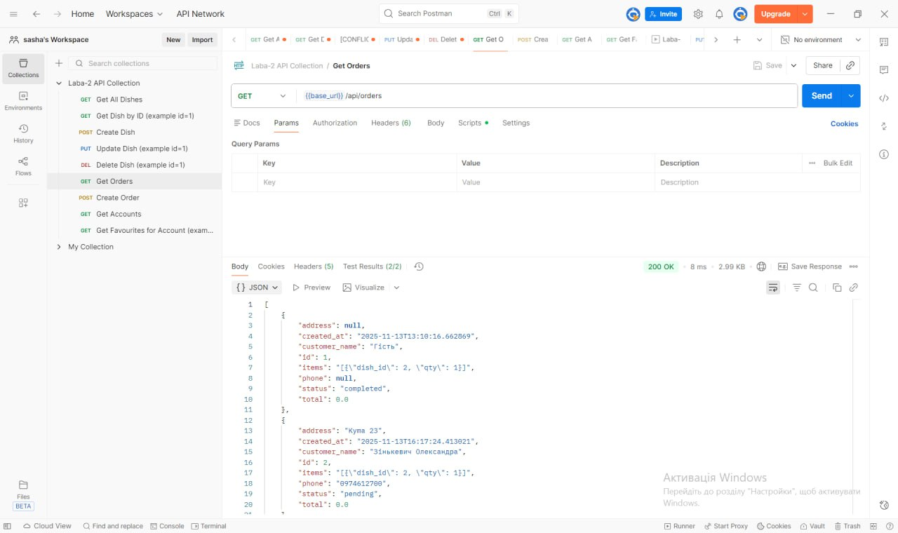

### Тестовий сценарій 7: [Create Order]
- **Мета:** Перевірити, що API дозволяє створити нове замовлення з коректними даними.]
- **Результат:** ✅ Успішно 
- **Скріншот:**
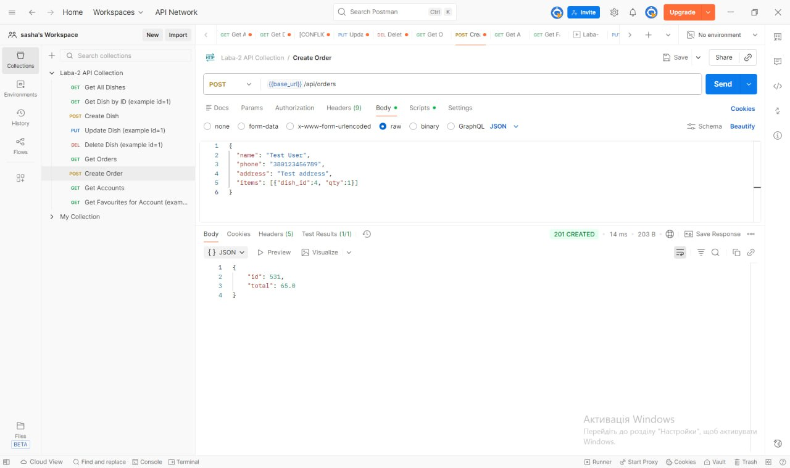

### Тестовий сценарій 8: [Get Accounts]
- **Мета:** [Перевірити, що API повертає список всіх акаунтів у форматі JSON зі статусом 200.]
- **Результат:** ✅ Успішно 
- **Скріншот:**
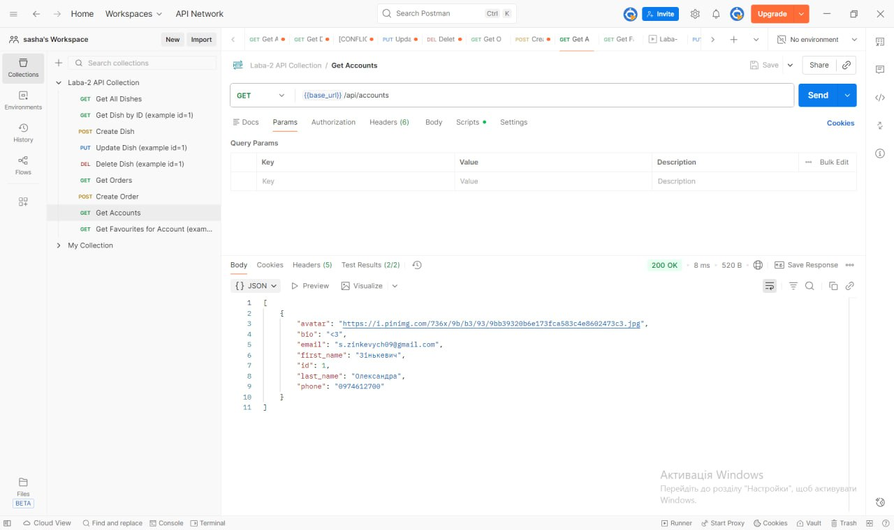

### Тестовий сценарій 9: [Get Favourites for Account]
- **Мета:** [Перевірити, що API повертає список обраних страв для конкретного акаунта]
- **Результат:** ✅ Успішно 
- **Скріншот:**
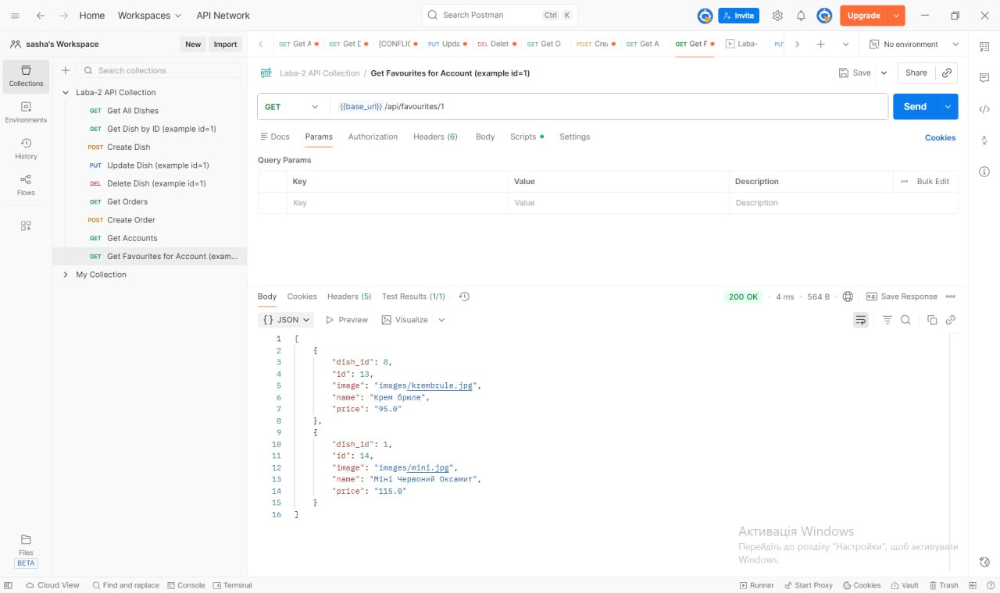

## Обробка помилок
Список реалізованих кодів помилок:
- `400 Bad Request` - [валідація/помилки запиту]
- `404 Not Found` - [коли ресурс не знайдено]
- `500 Internal Server Error` - [неочікувана помилка на сервері]
- `403 Forbidden` - [коли користувач не має прав доступу до ресурсу]
