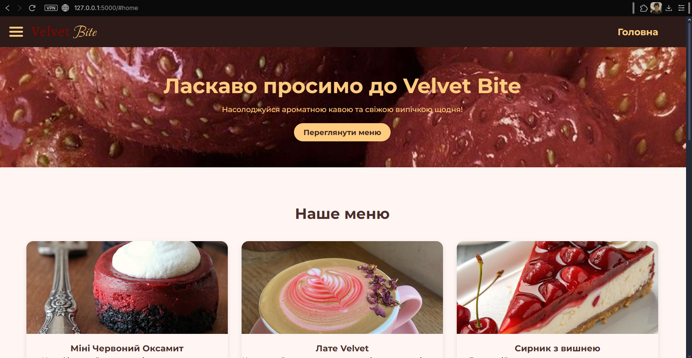
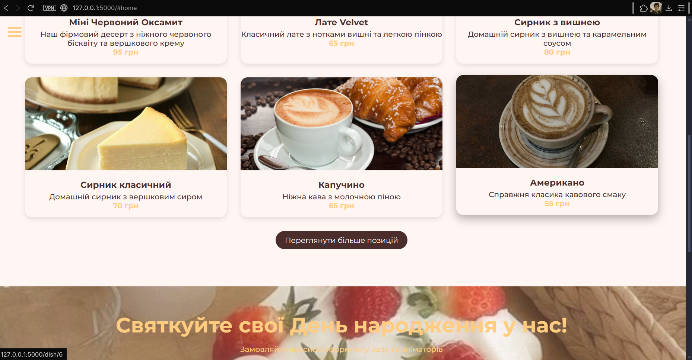
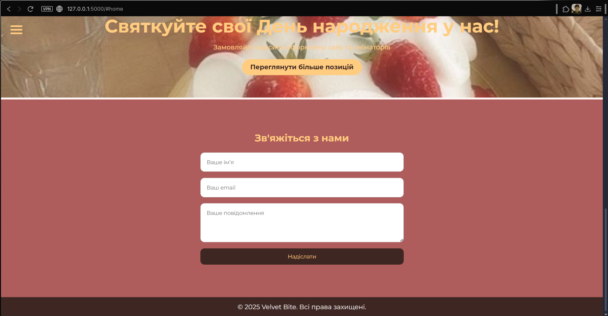
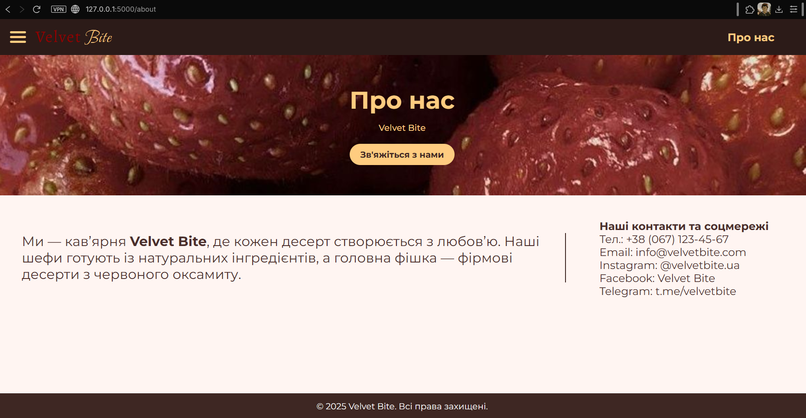
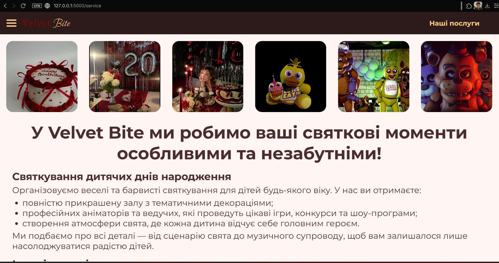
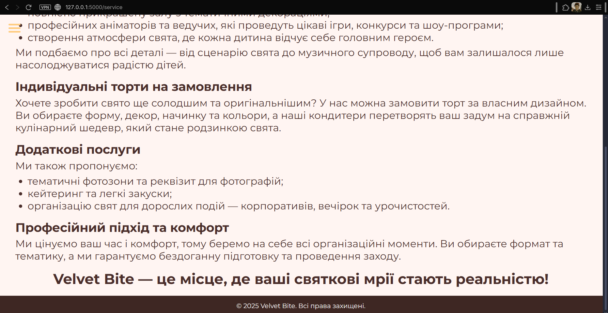
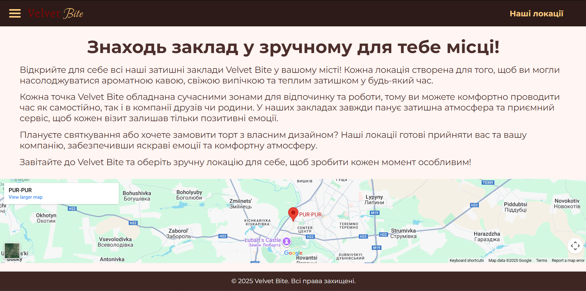
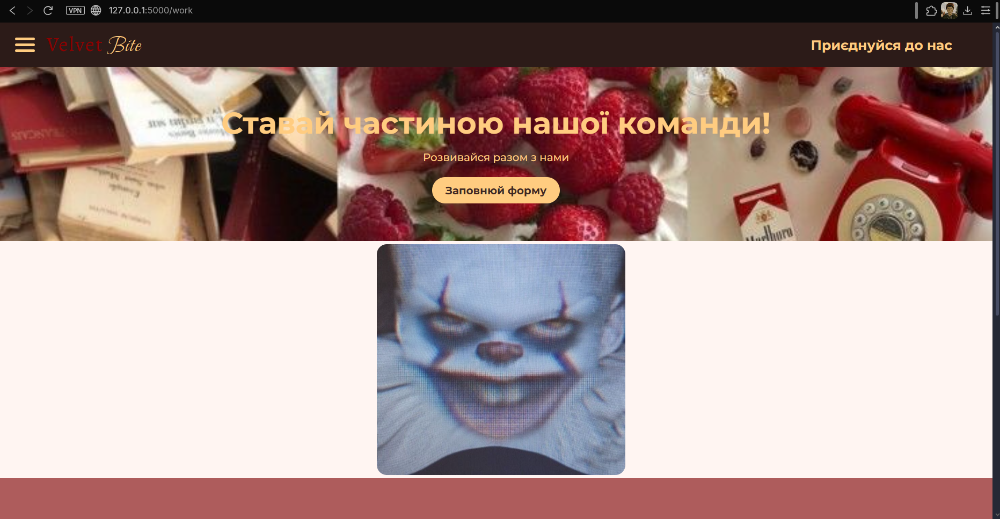
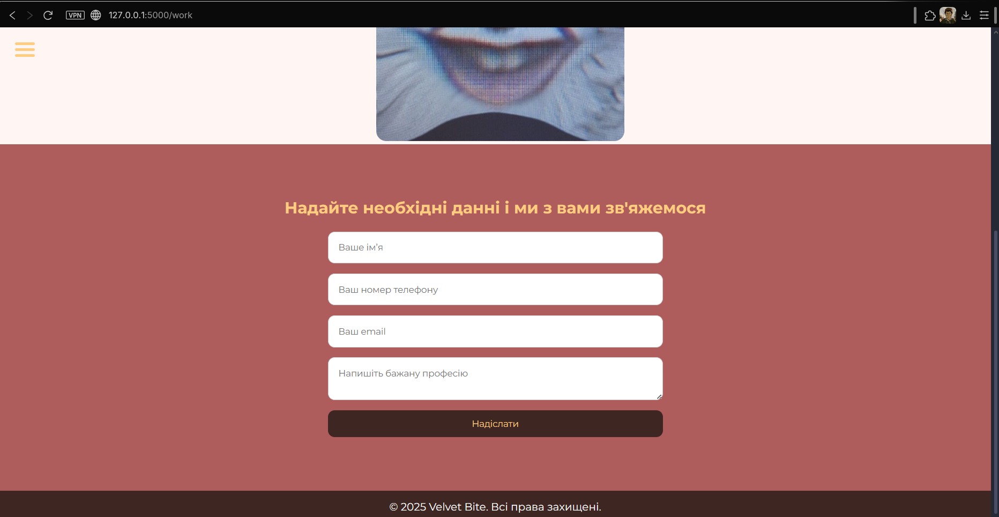

Poopii `,\ ㅤ, [25.10.2025 11:29]
# Звіт з лабораторної роботи 3

## Розробка базового вебпроєкту

### Інформація про команду
- Назва команди: Ґерики

- Учасники:
  ⦁Скоп`юк Олександра Іванівна, Team Leader 
  ⦁Зінькевич Олександра Василівна, Developer 
  ⦁Матяш Дарія Сергіївна, QA/Документатор

## Завдання

### Обрана предметна область

 Вебзастосунок кафе "Velvet bite"

### Реалізовані вимоги

Вкажіть, які рівні завдань було виконано:

- [+] Рівень 1: Створено сторінки "Головна" та "Про нас"
- [+] Рівень 2: Додано мінімум дві додаткові статичні сторінки з меню та адаптивною версткою

## Хід виконання роботи

### Підготовка середовища розробки

Опишіть процес встановлення та налаштування:

- Версія Python 3.11
- Встановлення Flask (pip install Flask)
- VSCode, git, github

### Структура проєкту

Наведіть структуру файлів та директорій вашого проєкту:

LABA-2/
├── .idea/ # Налаштування середовища (VS Code)
│ ├── inspectionProfiles/
│ ├── laba-2.iml
│ ├── misc.xml
│ ├── modules.xml
│ └── vcs.xml
├── lab3-reports/ # Звіти з лабораторних робіт
│ ├── lab03-report-DashaMatyash.md
│ ├── lab03-report-SashaSkopiuk.md
│ └── lab03-report-SashaZinkevych.md
├── static/ # Статичні файли
│ ├── images/ # Зображення для сторінок
│ ├── script.js # JavaScript для інтерактивності
│ └── style.css # Основні стилі сайту
├── templates/ # HTML-шаблони Flask
│ ├── about.html # Сторінка "Про нас"
│ ├── dish.html # Сторінка з меню
│ ├── index.html # Головна сторінка
│ ├── locate.html # Сторінка з картою або контактами
│ ├── service.html # Сторінка про послуги
│ └── work.html # Додаткова сторінка (наприклад, вакансії)
├── .gitignore # Ігноровані файли Git
├── CHANGELOG.md # Лог змін у проєкті
├── laba-2-report.md # Звіт з попередньої лабораторної роботи
├── main.py # Головний файл застосунку Flask
└── README.md # Опис проєкту

### Опис реалізованих сторінок

#### Головна сторінка
Головна сторінка вебзастосунку «Velvet Bite» є центральною частиною сайту, з якої користувач розпочинає взаємодію.

Зміст сторінки:

Верхня частина містить навігаційну панель (header) з логотипом Velvet Bite та меню переходів.
Користувач може перейти на будь-яку сторінку сайту: «Про нас», «Наші послуги», «Наші локації», «Приєднуйтеся до нас».

У секції Hero розташоване привітальне повідомлення:
«Ласкаво просимо до Velvet Bite» і короткий опис — «Насолоджуйся ароматною кавою та свіжою випічкою щодня!».
Тут також є кнопка, яка веде до меню.

Далі розміщена секція меню, де автоматично виводяться позиції з бази або словника menu_items у Flask.
Для кожної страви показано зображення, назву, опис і ціну.
Використано Jinja-шаблон з циклом  для генерації елементів меню динамічно.
Також додано кнопку «Переглянути більше позицій», яка дозволяє розгорнути приховані елементи (через JS).

Наступна частина (hero2) — рекламний блок, що пропонує користувачам замовити святкування днів народження у кафе, з кнопкою переходу до сторінки послуг.

Наприкінці розміщена форма зворотного зв’язку, де користувач може залишити своє ім’я, email та повідомлення.

Функціональність:
На головній сторінці сайту Velvet Bite реалізовано такі функціональні елементи:

Динамічне бургер-меню. У верхній частині сторінки є кнопка-іконка (три смужки), при натисканні на яку відкривається навігаційне меню з пунктами:
Головна, Меню, Зв'язок, Про нас, Наші послуги, Наші локації, Приєднуйтеся до нас.
Кнопка працює динамічно — меню можна як відкрити, так і закрити повторним натисканням.

Кнопка “Переглянути меню”. На головному банері є кнопка, при натисканні на яку сторінка автоматично прокручується до секції з меню.

Блок меню. У цій секції відображаються різні страви із зображенням, назвою, описом і ціною.
Коли користувач натискає на конкретну страву, відкривається окреме вікно (сторінка) з детальним описом цієї страви.

Кнопка “Переглянути більше позицій”. Спочатку показано лише частину страв, а решта приховані. При натисканні на цю кнопку відкриваються всі інші позиції меню.

Poopii `,\ ㅤ, [25.10.2025 11:29]
Блок із рекламою послуг. Є секція, яка запрошує святкувати День народження у закладі. Кнопка в цьому блоці переводить користувача на сторінку “Наші послуги”.

Форма зворотного зв’язку. У нижній частині сторінки є форма, де можна ввести ім’я, email і повідомлення, щоб надіслати звернення.

Футер. Унизу сторінки розміщено копірайт із зазначенням прав.

#### Сторінка "Про нас"

Зміст та функціональність сторінки “Про нас”
Сторінка “Про нас” містить інформацію про кав’ярню Velvet Bite, її концепцію та контактні дані.
У верхній частині сторінки розташоване динамічне навігаційне меню, яке можна відкрити за допомогою кнопки-бургера. 

Основна частина сторінки складається з двох блоків:

Інформаційний блок, де описано ідею закладу, акцент на натуральних інгредієнтах і фірмових десертах з червоного оксамиту.

Блок контактів, який містить номер телефону, електронну пошту, посилання на соціальні мережі (Instagram, Facebook, Telegram) — усе зручно структуровано для користувача.

Крім того, на сторінці є кнопка “Зв'яжіться з нами”, яка веде на форму зворотного зв’язку на головній сторінці. При натисканні користувач переходить до секції, де можна ввести:ім’я, email, повідомлення, та натиснути кнопку “Надіслати” для відправлення звернення.

Унизу сторінки знаходиться футер із копірайтом.
#### Додаткові сторінки (якщо реалізовано)

Зміст та функціональність сторінки “Наші послуги”

Сторінка “Наші послуги” представляє перелік послуг кав’ярні Velvet Bite, пов’язаних із проведенням свят, замовленням тортів та організацією подій.
У верхній частині сторінки знаходиться динамічне меню навігації, яке відкривається при натисканні на кнопку-бургер. 

Основний контент складається з кількох тематичних блоків:

Галерея зображень. У верхній частині сторінки відображено серію фото залів, тортів, аніматорів та святкових подій — вони створюють візуальне уявлення про атмосферу свят у закладі.

Опис послуг. Нижче розміщено детальні описи основних напрямів:

Святкування дитячих днів народження — прикрашена зала, тематичні декорації, аніматори, конкурси, музичний супровід.

Індивідуальні торти на замовлення — можливість вибору дизайну, форми, начинки, кольорів.

Додаткові послуги — фотозони, кейтеринг, організація корпоративів і вечірок.

Професійний підхід та комфорт — наголос на тому, що клієнтам не потрібно перейматись деталями, адже команда Velvet Bite все бере на себе.

У нижній частині сторінки розташований мотивуючий слоган:

“Velvet Bite — це місце, де ваші святкові мрії стають реальністю!”

Також є футер із копірайтом і базовою інформацією про права закладу.

Сторінка “Наші локації”

Опис:
Сторінка “Наші локації” призначена для ознайомлення користувачів із закладами мережі Velvet Bite. Вона містить опис філософії компанії — створювати комфортну атмосферу для відпочинку, роботи та зустрічей у будь-якому місті. Дизайн сторінки витриманий у стилі бренду, із плавною типографією та затишною кольоровою гамою, що викликає асоціації з кавою та домашнім теплом.

Функціональність:

Відображення інформаційного тексту про мережу локацій Velvet Bite.

Вбудована Google Карта (iframe) для візуального відображення розташування одного із закладів.

Зручна навігація через верхнє меню для переходу на інші сторінки сайту.

Сторінка “Приєднуйся до нас!”

Опис:
Сторінка “Приєднуйся до нас!” створена для користувачів, які хочуть стати частиною команди Velvet Bite. Вона містить короткий заклик до дії, візуальний банер і форму зворотного зв’язку для подання заявки на роботу.

Функціональність:

При натисканні кнопки «Заповнюй форму» користувача автоматично переносить до форми нижче.

У формі можна ввести ім’я, номер телефону, email та бажану професію.

Після заповнення можна натиснути «Надіслати», щоб відправити дані.

Є адаптивна навігація з динамічним бургер-меню, що відкриває список сторінок сайту.
## Ключові фрагменти коду

### Маршрутизація в Flask

Приклад налаштування маршрутів у файлі main.py:

Poopii `,\ ㅤ, [25.10.2025 11:29]
# --- Головна сторінка ---
@app.route('/')
def index():
    return render_template('index.html', menu_items=menu_items)

# --- Сторінка окремої страви ---
@app.route('/dish/<int:dish_id>')
def dish(dish_id):
    dish = next((d for d in menu_items if d["id"] == dish_id), None)
    return render_template('dish.html', dish=dish)

# --- Інші сторінки ---
@app.route('/about')
def about():
    return render_template('about.html')

@app.route('/service')
def service():
    return render_template('service.html')

@app.route('/locate')
def locate():
    return render_template('locate.html')

@app.route('/work')
def work():
    return render_template('work.html')

### Базовий шаблон

 фрагмент базового шаблону index.html:
 
<!DOCTYPE html>
<html lang="uk">
<head>
    <meta charset="UTF-8">
    <meta name="viewport" content="width=device-width, initial-scale=1.0">
    <title>Velvet Bite</title>
    <link rel="stylesheet" href="{{ url_for('static', filename='style.css') }}">
</head>
<body>
    <!-- Навігація -->
    <header>
        <nav>
            <ul>
                <li><a href="{{ url_for('index') }}">Головна</a></li>
                <li><a href="{{ url_for('about') }}">Про нас</a></li>
                <li><a href="{{ url_for('service') }}">Послуги</a></li>
                <li><a href="{{ url_for('locate') }}">Локації</a></li>
                <li><a href="{{ url_for('work') }}">Приєднуйтеся до нас</a></li>
            </ul>
        </nav>
    </header>

    <!-- Основний контент -->
    <main>
        
    </main>

    <!-- Футер -->
    <footer>
        
© 2025 Velvet Bite. Всі права захищені.

    </footer>
</body>
</html>

## Розподіл обов'язків у команді

Опишіть внесок кожного учасника команди:

⦁Скоп`юк Олександра Іванівна: Керувала всім процесом, створила репозиторій, структуру та допомагала з дизайном
⦁Зінькевич Олександра Василівна: Написала код для сайту, дизайн, функціональність
⦁Матяш Дарія Сергіївна: Перевіряла коди, тестила на багі, займалась всією документацією

## Скріншоти
### Головна сторінка

### Сторінка "Про нас"

### Додаткові сторінки

### Висновки

Опишіть:

- Що вдалося реалізувати успішно:Все що вимагалося і навіть більше, роботу виконано з творчим підходом!
- З якими труднощами зіткнулися:Багався header
- Які навички та знання отримали:Зрозуміли прицнипи роботи з багатосторінковими сайтами
- Які можливості для вдосконалення проєкту бачите:Додамо базу данних SQLite та можливість додавити страви до вибранного

Очікувана оцінка: [10]

Обґрунтування: Робота виконана повністю відповідно до завдання та включає додаткові функціональні елементи, такі як динамічне меню, адаптивний дизайн і окремі сторінки з детальним описом страв. Проєкт демонструє розуміння принципів багатосторінкових вебзастосунків на Flask, командну роботу та практичне застосування HTML, CSS, і JS.