# Звіт з лабораторної роботи 4

## Реалізація бази даних для вебпроєкту

### Інформація про команду
- Назва команди: Ґерики

- Учасники:
  ⦁Скоп`юк Олександра Іванівна, Team Leader 
  ⦁Зінькевич Олександра Василівна, Developer 
  ⦁Матяш Дарія Сергіївна, QA/Документатор

## Завдання

### Обрана предметна область

Вебзастосунок кафе "Velvet bite"

### Реалізовані вимоги

Вкажіть, які рівні завдань було виконано:

- [+] Рівень 1: Створено базу даних SQLite з таблицею для відгуків, реалізовано базові CRUD операції, створено адмін-панель для перегляду та видалення відгуків, додано функціональність магазину з таблицями для товарів та замовлень
- [+] Рівень 2: Створено додаткову таблицю, релевантну предметній області, реалізовано роботу з новою таблицею через адмін-панель, інтегровано функціональність у застосунок
- [+] Рівень 3: Розширено функціональність двома додатковими функціями, що суттєво покращують користувацький досвід

## Хід виконання роботи

### Підготовка середовища розробки

Опишіть процес налаштування:

- Версія Python 3.11
- Встановлені бібліотеки: Flask, SQLite3
- Інші використані інструменти та розширення

### Структура проєкту

Наведіть структуру файлів та директорій вашого проєкту:

```
LABA-2/
│
├── .idea/
│   ├── inspectionProfiles/
│   ├── misc.xml
│   ├── modules.xml
│   ├── vcs.xml
│   └── laba-2.iml
│
├── lab3-reports/
│   ├── Screenshots/
│   ├── lab03-report-DashaMatyash.md
│   ├── lab03-report-SashaSkopiuk.md
│   └── lab03-report-SashaZinkevych.md
│
├── lab4-reports/
│   ├── Screenshots/
│   ├── lab04-report-DashaMatyash.md
│   ├── lab04-report-SashaSkopiuk.md
│   └── lab04-report-SashaZinkevych.md
│
├── static/
│   ├── images/
│   ├── script.js
│   └── style.css
│
├── templates/
│   ├── about.html
│   ├── account_edit.html
│   ├── account.html
│   ├── add_dish.html
│   ├── admin_edit_account.html
│   ├── admin_edit_dish.html
│   ├── admin_login.html
│   ├── admin.html
│   ├── dish.html
│   ├── favourite.html
│   ├── index.html
│   ├── locate.html
│   ├── order.html
│   ├── service.html
│   ├── signUp.html
│   └── work.html
│
├── .gitignore
├── CHANGELOG.md
├── database.py
├── laba-2-report.md
├── main.py
├── my_database.db
└── README.md

```

### Проектування бази даних

#### Схема бази даних

Опишіть структуру вашої бази даних:

```
Таблиця "feedback":
- id INTEGER PRIMARY KEY AUTOINCREMENT
- name TEXT
- email TEXT
- text TEXT

Таблиця "orders":
- id INTEGER PRIMARY KEY AUTOINCREMENT
- customer_name TEXT
- phone TEXT
- address TEXT
- items TEXT
- total REAL
- created_at TEXT
- status TEXT

Таблиця "dish":
- id INTEGER PRIMARY KEY AUTOINCREMENT
- name TEXT
- price REAL
- image TEXT
- description TEXT
- ingredients TEXT
- calories INTEGER

Таблиця "work":
- id INTEGER PRIMARY KEY AUTOINCREMENT
- name TEXT
- phone TEXT
- email TEXT
- profecy TEXT

Таблиця "accounts":
- id INTEGER PRIMARY KEY AUTOINCREMENT
- first_name TEXT
- last_name TEXT
- phone TEXT
- email TEXT
- avatar TEXT DEFAULT ''
- bio TEXT DEFAULT ''

Таблиця "favourites":
- id INTEGER PRIMARY KEY AUTOINCREMENT
- dish_id INTEGER
- account_id INTEGER

Таблиця "admin_accounts":
- id INTEGER PRIMARY KEY AUTOINCREMENT
- username TEXT UNIQUE
- password_hash TEXT

```

### Опис реалізованої функціональності

#### Система відгуків

Система збору та відображення відгуків користувачів реалізована за допомогою веб-форми на головній сторінці та таблиці в адмін-панелі. Користувачі можуть залишати свої відгуки, заповнивши поля «Ім’я», «Email» та «Повідомлення» у формі і натиснувши кнопку «Надіслати». Дані форми надсилаються на сервер через POST-запит, де вони обробляються та зберігаються у базі даних. Після успішного додавання відгуку користувач отримує повідомлення про успіх через систему flash-повідомлень.

Адміністратор має доступ до окремої сторінки, на якій відображаються всі надіслані відгуки у вигляді таблиці. Кожен відгук містить унікальний ідентифікатор, ім’я користувача, його електронну пошту та текст повідомлення. Такий підхід забезпечує ефективний збір зворотного зв’язку від користувачів та зручне його відображення для адміністрування сайту.

#### Магазин(кафе)

Опишіть функціональність магазину(кафе):

- Відображення каталогу товарів: На головній сторінці в секції меню відображаються всі страви з каталогу. Кожна позиція містить зображення, назву, опис та ціну. Для зручності користувачів передбачена кнопка «Переглянути більше позицій», яка дозволяє завантажувати додаткові страви.
- Додавання товарів до кошика: Користувач може перейти на сторінку окремої страви, де доступні кнопки для додавання до улюблених та до замовлення. Замовлення формуються на окремій сторінці «Оформлення замовлення», де користувач обирає страви, їх кількість, бачить загальну суму та може відправити замовлення на обробку.
- Оформлення замовлення: На сторінці замовлення користувач вводить свої контактні дані, номер столу (для dine-in) та додає обрані страви. Система відображає список доданих товарів з можливістю змінювати кількість або видаляти позиції. Після підтвердження замовлення воно зберігається у базі даних та відображається у розділі «Мої попередні замовлення».
- Управління товарами через адмін-панель: Адміністратор має доступ до спеціальної панелі, де можна переглядати всі страви, додавати нові, редагувати існуючі та видаляти їх. Для додавання або редагування доступні всі необхідні поля: назва, ціна, опис, інгредієнти, калорії та зображення. Це забезпечує повний контроль над меню та актуальність інформації для користувачів.

#### Адміністративна панель

Опишіть можливості адмін-панелі:

- Перегляд відгуків: Адміністратор має доступ до списку всіх відгуків користувачів, що надходять через форму на сайті. Для кожного відгуку відображаються унікальний ідентифікатор, ім’я, електронна пошта та текст повідомлення, що дозволяє відслідковувати зворотний зв’язок і при необхідності реагувати на нього.
- Управління товарами: Адмін може переглядати всі страви, додавати нові, редагувати існуючі та видаляти непотрібні. Для редагування доступні поля: назва, ціна, опис, інгредієнти, калорійність та зображення. Це дозволяє підтримувати актуальність меню та контролювати його зміст.
- Управління замовленнями: Система дозволяє переглядати всі замовлення клієнтів із зазначенням імені, телефону, адреси, переліку страв, загальної суми та статусу. Адміністратор може оновлювати статус замовлення (нове, в очікуванні, у приготуванні, готово, завершено), що забезпечує ефективний процес обробки та контролю замовлень.
- Інші функції: Адмін-панель також містить розділи для перегляду заявок на роботу та акаунтів користувачів. Можна переглядати дані користувачів та видаляти акаунти при необхідності. Це забезпечує загальне управління всіма активними об’єктами системи та підтримку адміністративного контролю.

#### Додаткова функціональність (якщо реалізовано)

Замовлення:

Користувач може оформити замовлення на страви з меню через інтерактивну форму. Для кожного замовлення відображаються обрані страви, їх кількість та загальна сума. Користувач може додавати нові страви, редагувати кількість або видаляти їх зі списку перед відправкою. Крім того, доступна історія попередніх замовлень із зазначенням ID, складу замовлення, суми та статусу, що дозволяє контролювати власні покупки та відстежувати їх виконання.

Улюблені страви:

Користувач має можливість додавати страви до списку улюблених для швидкого доступу в майбутньому. Для кожної страви відображаються назва, зображення та ціна. Список дозволяє переглядати деталі страви та видаляти непотрібні позиції. Це підвищує комфорт користування сайтом та допомагає швидко знаходити вподобані страви.

Профіль:

Користувач може переглядати особисті дані, включаючи ім’я, прізвище, email, телефон та інформацію «Про мене». Доступні функції редагування профілю та аватара, перегляд улюблених страв та історії замовлень із зазначенням складу, суми та статусу. Це дозволяє користувачу контролювати власні дані, відстежувати активність та керувати вподобаннями.

Приєднуйтесь до нас:

Користувачі можуть заповнити форму для подання заявки на роботу або стажування. Форма передбачає введення імені, телефону, email та бажаної професії. Всі заявки зберігаються для подальшого перегляду адміністратором, що дозволяє організовувати роботу та підбирати персонал відповідно до потреб компанії.

Вхід в адмін-панель:

Адміністратор може здійснити вхід на сайт через форму логіну з іменем користувача та паролем. Після успішної автентифікації відкривається доступ до функціоналу управління сайтом, включно з товарами, замовленнями, відгуками та заявками на роботу. Також передбачена можливість повернутися на головний сайт без авторизації.

## Ключові фрагменти коду

### Ініціалізація бази даних

Наведіть код створення таблиць у файлі `models.py`:

```python
import sqlite3

def init_db():
    db = get_db()
    cursor = db.cursor()
    cursor.execute('''
        CREATE TABLE IF NOT EXISTS dish (
            id INTEGER PRIMARY KEY AUTOINCREMENT,
            name TEXT,
            price REAL,
            image TEXT,
            description TEXT,
            ingredients TEXT,
            calories INTEGER
        )
    ''')
    cursor.execute('''
        CREATE TABLE IF NOT EXISTS work (
            id INTEGER PRIMARY KEY AUTOINCREMENT,
            name TEXT,
            phone TEXT,
            email TEXT,
            profecy TEXT
        )
    ''')
    cursor.execute('''
        CREATE TABLE IF NOT EXISTS orders (
            id INTEGER PRIMARY KEY AUTOINCREMENT,
            customer_name TEXT,
            phone TEXT,
            address TEXT,
            items TEXT,
            total REAL,
            created_at TEXT
        )
    ''')
    cursor.execute('''
        CREATE TABLE IF NOT EXISTS feedback (
            id INTEGER PRIMARY KEY AUTOINCREMENT,
            name TEXT,
            email TEXT,
            text TEXT
        )
    ''')
    cursor.execute('''
        CREATE TABLE IF NOT EXISTS accounts (
            id INTEGER PRIMARY KEY AUTOINCREMENT,
            first_name TEXT,
            last_name TEXT,
            phone TEXT,
            email TEXT,
            avatar TEXT DEFAULT '',
            bio TEXT DEFAULT ''
        )
    ''')
    cursor.execute('''
        CREATE TABLE IF NOT EXISTS favourites (
            id INTEGER PRIMARY KEY AUTOINCREMENT,
            dish_id INTEGER,
            account_id INTEGER
        )
    ''')

    
```

### CRUD операції

Наведіть приклади реалізації CRUD операцій:

#### Створення (Create)

```python
def add_dish(name, price, image, description, ingredients, calories):
    db = get_db()
    cursor = db.cursor()
    cursor.execute(
        'INSERT INTO dish (name, price, image, description, ingredients, calories) VALUES (?, ?, ?, ?, ?, ?)',
        (name, price, image, description, ingredients, calories)
    )
    db.commit()
    return cursor.lastrowid
```

#### Читання (Read)

```python
def get_orders_by_phone(phone):
    db = get_db()
    cursor = db.cursor()
    cursor.execute('SELECT * FROM orders WHERE phone = ? ORDER BY created_at DESC', (phone,))
    return cursor.fetchall()
```

#### Оновлення (Update)

```python
def update_account_profile(account_id, first_name, last_name, phone, email, avatar='', bio=''):
    db = get_db()
    cursor = db.cursor()
    try:
        cursor.execute('UPDATE accounts SET first_name = ?, last_name = ?, phone = ?, email = ?, avatar = ?, bio = ? WHERE id = ?',
                       (first_name, last_name, phone, email, avatar, bio, account_id))
    except Exception:
        cursor.execute('UPDATE accounts SET first_name = ?, last_name = ?, phone = ?, email = ? WHERE id = ?',
                       (first_name, last_name, phone, email, account_id))
    db.commit()
```

#### Видалення (Delete)

```python
def delete_dish(dish_id):
    db = get_db()
    cursor = db.cursor()
    cursor.execute('DELETE FROM dish WHERE id = ?', (dish_id,))
    db.commit()
```

### Маршрутизація

Наведіть приклади маршрутів для роботи з базою даних:

```python
@app.route('/contact/add_feedback', methods=['GET', 'POST'])
def add_feedback_route():
    if request.method == 'POST':
        name = request.form.get('name', '').strip()
        email = request.form.get('email', '').strip()
        text = request.form.get('text', '').strip()
        try:
            add_feedback(name, email, text)
            flash('Ваш запит надіслано!', 'success')
            return redirect(url_for('index') + '#contact')
        except Exception as e:
            flash(f'Помилка: {str(e)}', 'error')

    return redirect(url_for('index') + '#contact')
```

### Робота зі зв'язками між таблицями

```python
def get_all_favourites(account_id=None):
    db = get_db()
    cursor = db.cursor()
    if account_id is None:
        cursor.execute('''
            SELECT f.id, f.dish_id, d.name, d.price, d.image, f.account_id 
            FROM favourites f 
            LEFT JOIN dish d ON f.dish_id = d.id
        ''')
    else:
        cursor.execute('''
            SELECT f.id, f.dish_id, d.name, d.price, d.image 
            FROM favourites f 
            LEFT JOIN dish d ON f.dish_id = d.id 
            WHERE f.account_id = ?
        ''', (account_id,))
    favs = cursor.fetchall()
    return favs

```

## Розподіл обов'язків у команді

Опишіть внесок кожного учасника команди:

  ⦁Скоп`юк Олександра Іванівна - слідкувала за роботою проетку, заповнення бази даних
  ⦁Зінькевич Олександра Василівна - написання коду, підключення і створення бази даних
  ⦁Матяш Дарія Сергіївна - документація, написання звітів, тестування


## Скріншоти

Додайте скріншоти основних функцій вашого вебзастосунку:

### Форма зворотного зв'язку

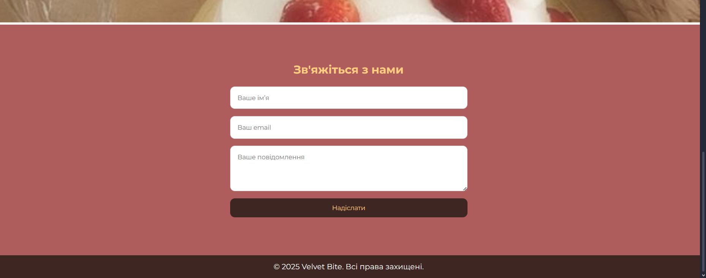

### Каталог товарів


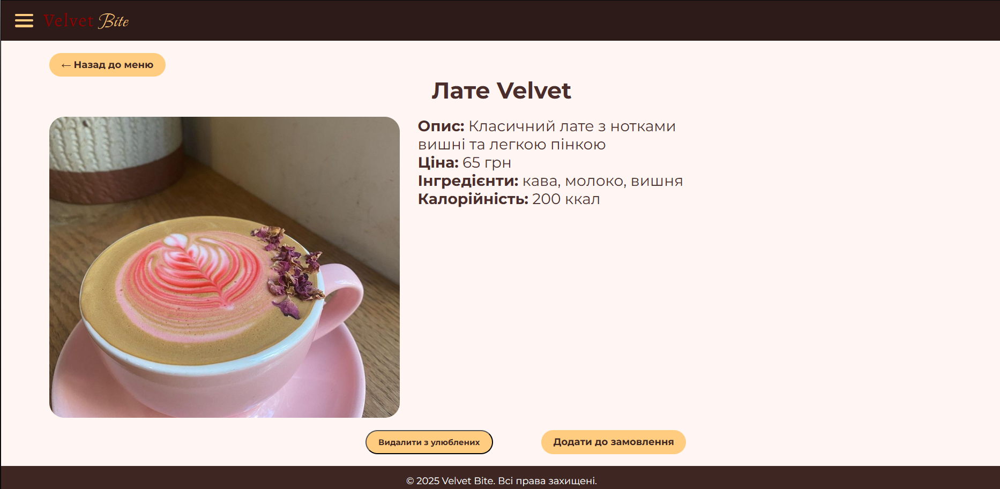

### Адміністративна панель

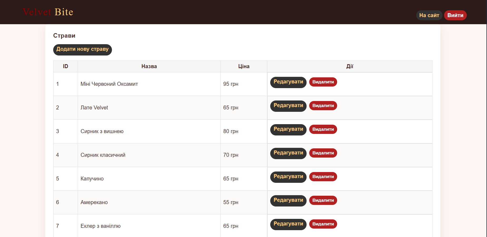

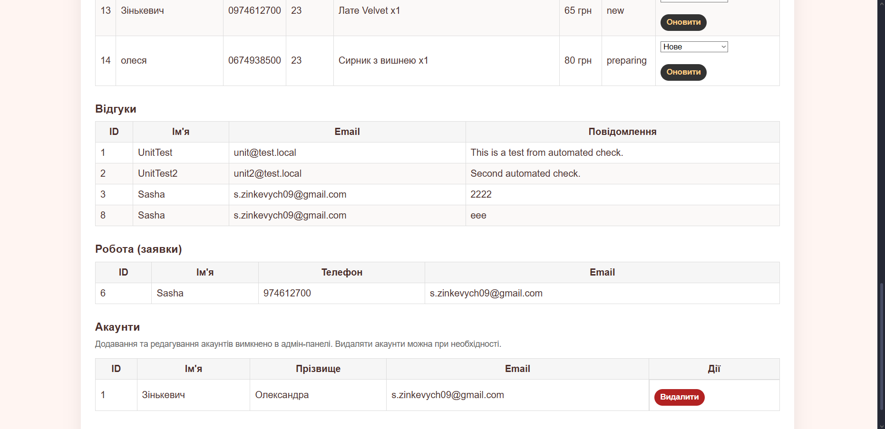

### Управління замовленнями

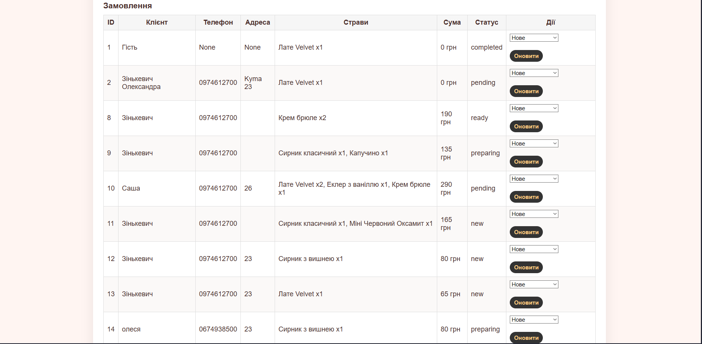

### Додаткова функціональність

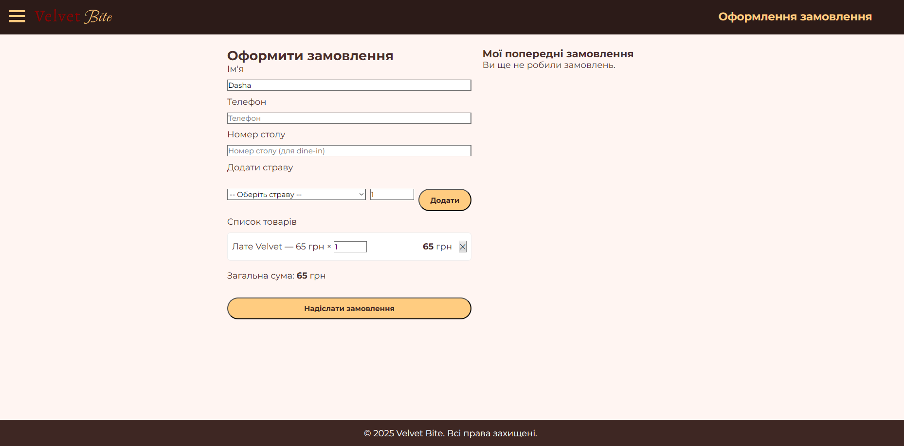

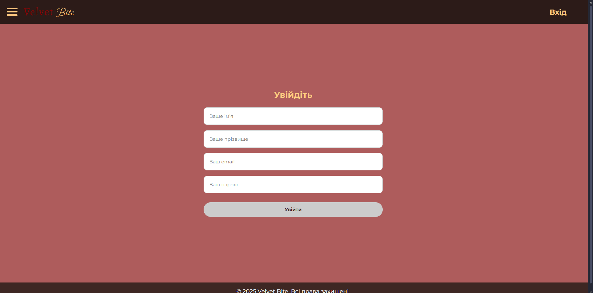

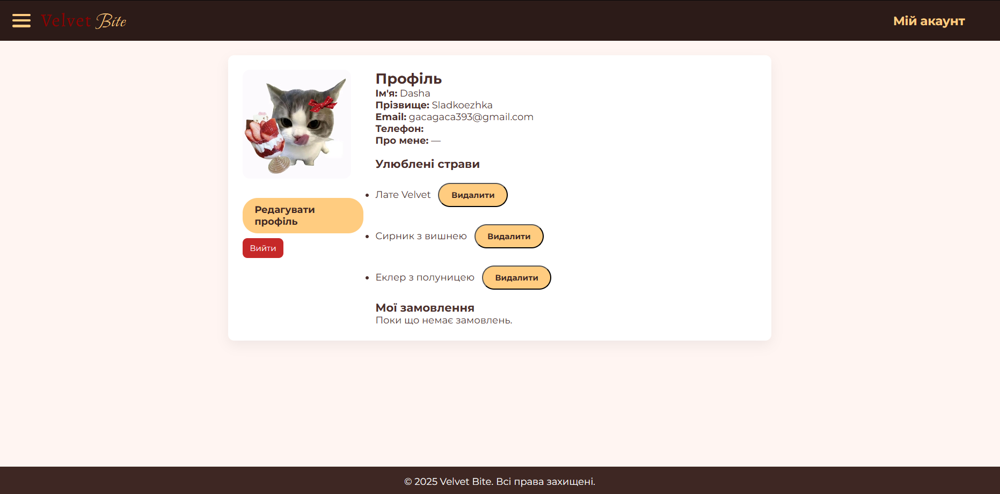

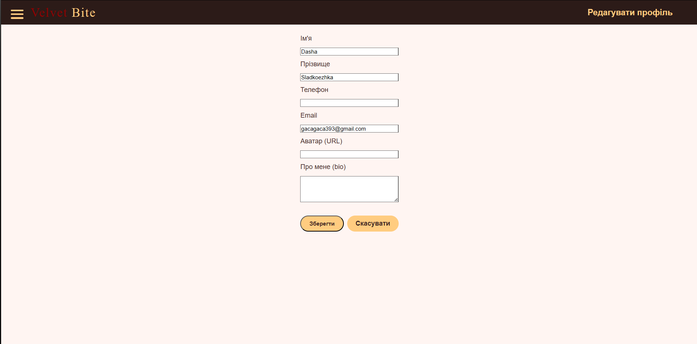

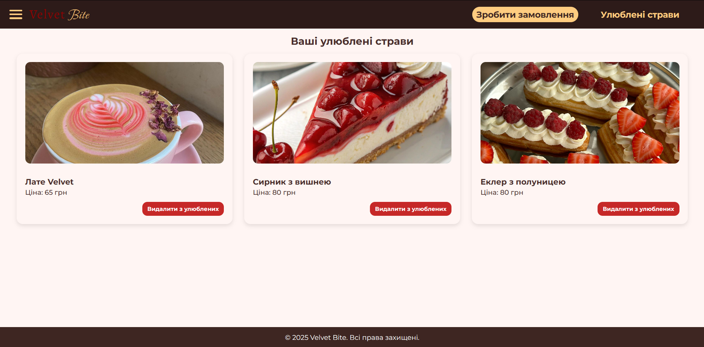

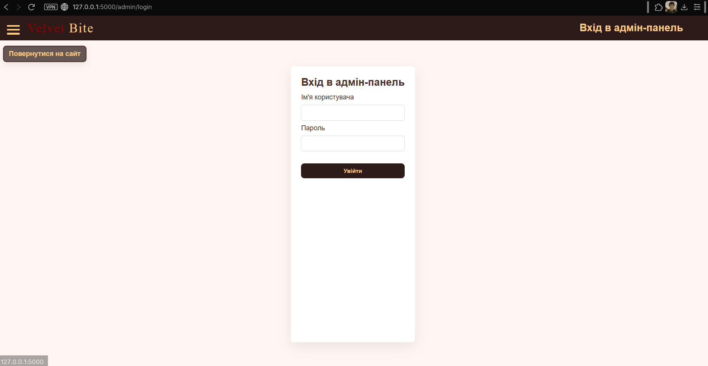

## Тестування

### Сценарії тестування

Опишіть, які сценарії ви тестували:

1. Додавання нового відгуку та перевірка його відображення в адмін-панелі
2. Додавання страви, додавання її до улюблених та до замовлення, оформлення замовлення
3. Зміна статусу замовлення через адмін-панель
4. Видалення записів з бази даних
5. Вхід в аккаунт і редагування
6. Видалення аккаунтів через адмін. панель


## Висновки

Опишіть:

- Що вдалося реалізувати успішно: Можливість додавання, редагування, додавання до улюблених страв. Вхід в аккаунт, редагування аккаунту, вхід в амін панель, керування в адмін панелі, фідбек, реалізовані всі вимоги 4 лабораторної роботи.
- Які навички роботи з базами даних отримали: створення/редагування таблиць, підключення бази даних до проекту
- Які труднощі виникли при проектуванні схеми БД: труднощі виникли при введенні інформації через сайт
- Як організували командну роботу: Наша команда працювала над проєктом спільно, розподіливши завдання між учасниками. Скоп`юк Олександра слідкувала за роботою команди і проекту, Зінькевич Олександра – працювала з базою даних і писала коди, Дарія Матяш – тестувала і писала всю документацію. Для координації ми використовували спільний чат і зідзвонювались в Discord. Регулярно проводили короткі зустрічі для обговорення прогресу та вирішення проблем, що виникали під час розробки.
- Які покращення можна внести в майбутньому: Додання оплати онлайн та можливості доставки

Очікувана оцінка: [10 балів]

Обґрунтування: Виконуючи роботу, я набула практичних навичок проектування та реалізації бази даних для веб-додатку. Освоїла створення та керування таблицями, впровадження CRUD-операцій для додавання, редагування, видалення та отримання даних, а також організацію зв’язків між таблицями для забезпечення коректного та ефективного доступу до інформації. Це дозволило зрозуміти, як структуровано зберігати дані та підтримувати їхню цілісність у реальних веб-проєктах. Виконано завдання з всіх трьох рівнів, додано додаткові функції, такі як: оформлення замовлень, вхід в/редагування аккаунту, додано адмін панель, додано сторінку для улюблених страв.
